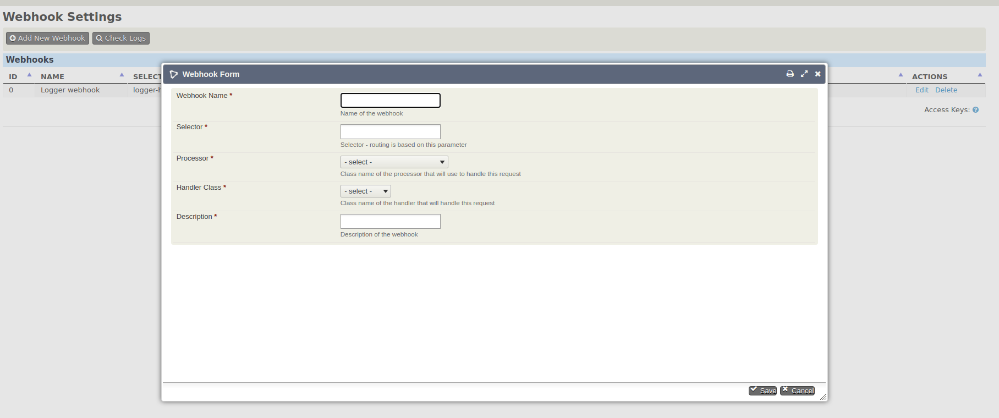

# webhook-admin

This extension provides a public API endpoint as listener for webhooks and an administrator interface for setting up handler applications for processing the incoming messages. The handler applications has to be inherited from the base handler. Currently it can process JSON, XML and standard URL encoded form data messages. This extension provides an example handler that saves the request details to database. This log could be checked and cleand from the administer pages. To extend the valueset of the processors or handler classes, implement them in your extension and pass it to the config, with extending the configuration object in the `hook_civicrm_webhookOptionValues` hook.

The extension is licensed under [AGPL-3.0](LICENSE.txt).

## Requirements

* PHP v7.3+
* CiviCRM 5.29+ (might work below, not tested)

## Installation (Web UI)

This extension has not yet been published for installation via the web UI.

## Installation (CLI, Zip)

Sysadmins and developers may download the `.zip` file for this extension and
install it with the command-line tool [cv](https://github.com/civicrm/cv).

```bash
cd <extension-dir>
cv dl webhook-admin@https://gitlab.com/semseysandor/webhook-admin/-/archive/master/webhook-admin-master.zip
```

## Installation (CLI, Git)

Sysadmins and developers may clone the [Git](https://en.wikipedia.org/wiki/Git) repo for this extension and
install it with the command-line tool [cv](https://github.com/civicrm/cv).

```bash
git clone git@github.com:reflexive-communications/webhook-admin.git
cv en webhook
```

## Usage

### Setup new hook

Go to the `Administer > Webhooks` menu. It will lead you to the `civicrm/admin/webhooks/settings` form.


Click to the `Add New Webhook` button. On the popup fill in the form. The selector has to be uniq. Save your changes with clicking to the `Save` button.



### Edit hook

Go to the `Administer > Webhooks` menu. It will lead you to the `civicrm/admin/webhooks/settings` form. Find the hook that you want to change and click to the `Edit` link in the actions block. On the popup make your changes and save it with clicking to the `Save` button.


### Delete hook

Go to the `Administer > Webhooks` menu. It will lead you to the `civicrm/admin/webhooks/settings` form. Find the hook that you want to delete and click to the `Delete` link in the actions block. On the popup click `Delete` button to remove it.


### Check logs

Go to the `Administer > Webhooks` menu. It will lead you to the `civicrm/admin/webhooks/settings` form. If you have logs in the log database the `Check Logs` button is visible next to the new hook button. Click the `Check Logs` button. It will lead you to the `civicrm/admin/webhooks/logs` page, where the existing logs are shown.


### Delete logs

Go to the `Administer > Webhooks` menu. It will lead you to the `civicrm/admin/webhooks/settings` form. If you have logs in the log database the `Check Logs` button is visible next to the new hook button. Click the `Check Logs` button. It will lead you to the `civicrm/admin/webhooks/logs` page, where the existing logs are shown. The `Delete logs` button is on the bottom of the page.

### Call endpoint.

The public endpoint is `/extensions/webhook-admin/external/listener.php`. A selector value has to be added as listener GET parameter. If the selector is `my-hook-handler`, then the endpoint of the listener application will be `/extensions/webhook-admin/external/listener.php?listener=my-hoook-listener`

### Extend the config

Implement the `hook_civicrm_webhookOptionValues` hook in your application and extend the config with your classes.

```php
/**
 * Implements hook_civicrm_webhookOptionValues().
 */
function myextension_civicrm_webhookOptionValues(&$config) {
    $config["processors"]["My_Processor_Class_Name"] = "My processor class label";
    $config["handlers"]["My_Handler_Class_Name"] = "My handler class label";
}
```
